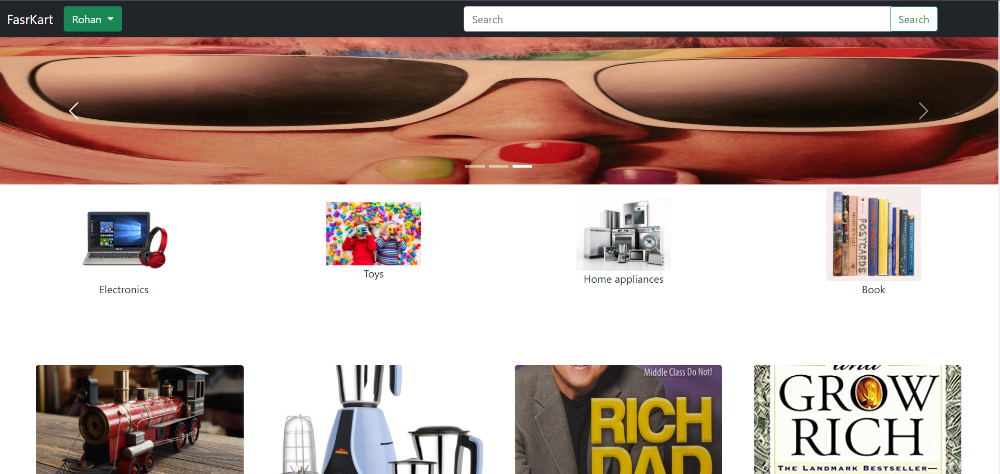

# Django e-commerce

This is a fully functional Django e-commerce site



## Features for site Owner
* Add, remove products and modefy products information
* Can see information about placed orders in database
* Beacuase for Django the site is scalable and secure
* Fully Responsive for all devices 

## Features for Users or Customers
* Create account, Login, Logout
* Cart
* Search Bar
* Product page 
* Products separated by categorys

## Installation

Use the package manager [pip](https://pip.pypa.io/en/stable/) to install foobar.

```bash
git clone https://github.com/reo127/ecomm.git

cd ecomm

virtualenv env

.\env\Scripts\activate  

pip install -r requirements.txt

python manage.py runserver
```


## Contributing
Pull requests are welcome. For major changes, please open an issue first to discuss what you would like to change.


## License
[MIT](https://choosealicense.com/licenses/mit/)